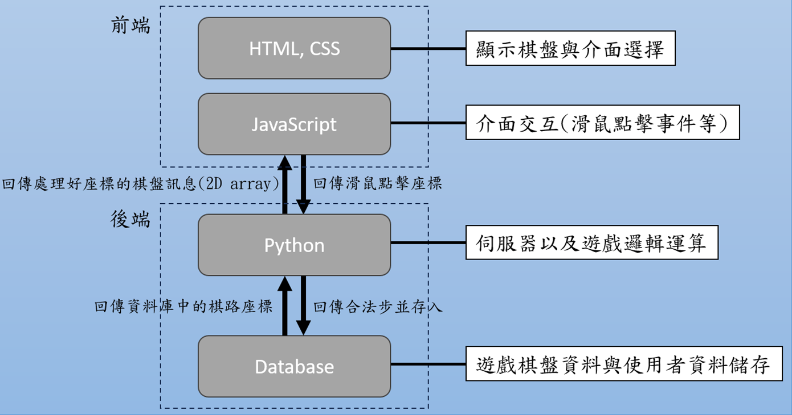
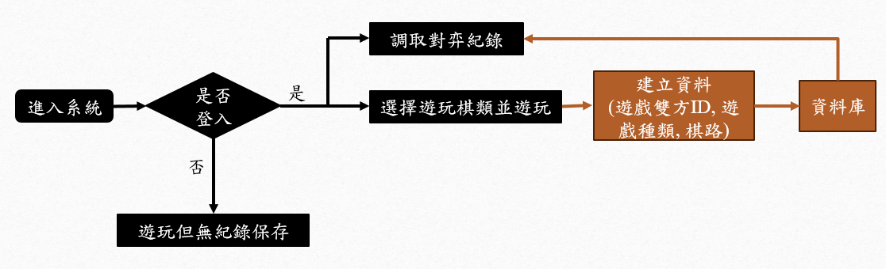
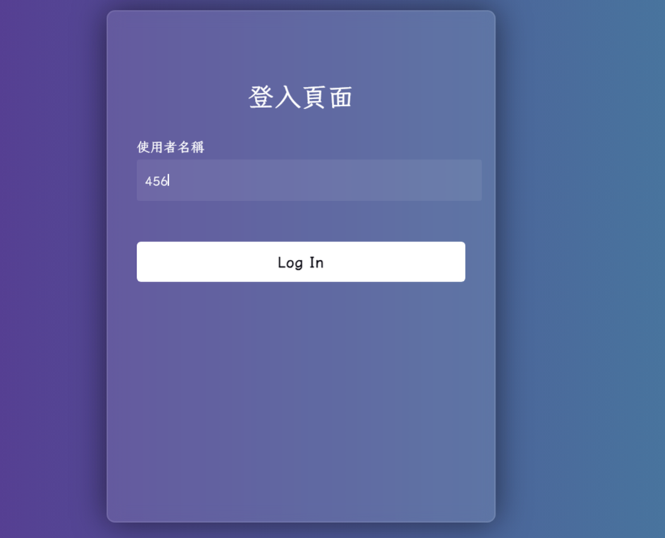
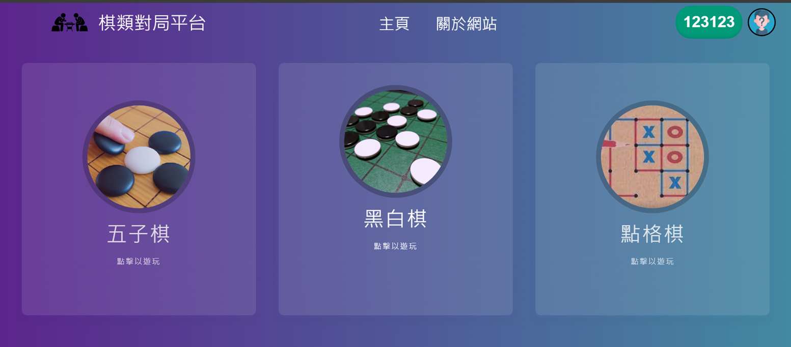
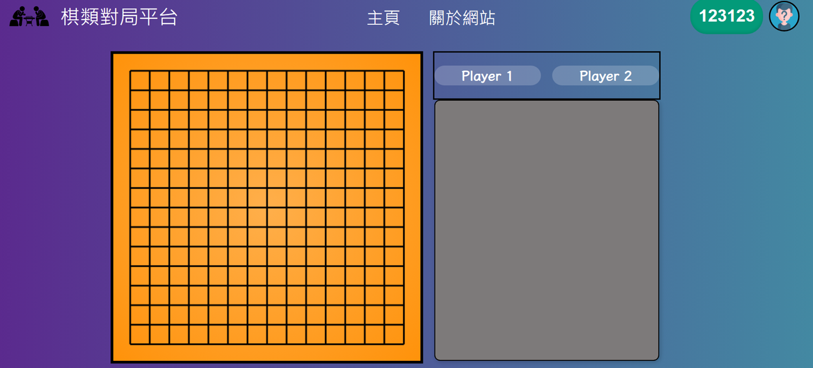

# 棋盤遊戲對局平台

## 壹、動機
藉由機器學習這堂課，我們接觸到電腦對局這門學問，並對其感到深度的興趣。然而當時實作使用的平台僅能遊玩黑白棋這一項棋類，且當發生玩家中離或是斷線後，平台並不會及時處理，只會陷入無窮的等待，直到離線玩家上線後重新對局，因此我們希望構建一個穩定且能夠讓玩家與我們訓練的模型進行對戰，亦或是使用玩家自己準備的模型來對戰的棋類平台。

## 貳、目標

1. **用戶登入**：使用Google帳號登入，並將用戶資料新增至資料庫中進行管理。可以選擇對手是要機器棋手或是線上匹配其他人類玩家連線對弈，並且能夠處理斷線及中途退出等問題。
2. **對手選擇**：玩家可以選擇與機器人對弈或與其他線上玩家進行匹配，並且能夠處理斷線及中途退出等問題。

3. **開放互動邏輯**：提供棋盤資料及遊戲互動邏輯的開放性，讓玩家也能夠使用自己的模型進入平台對弈。

4. **復盤功能**：從資料庫中提取玩家的遊戲紀錄，實現棋局復盤功能，並可將棋盤數據用於機器學習模型的訓練。

## 參、系統架構圖

## 肆、流程圖

## 伍、前端頁面展示

### 1. 登入頁面
用使用者名稱登入。

### 2. 主頁
網站的主要介面，點選欲遊玩的棋類即可遊玩。

### 3. 棋盤
可以顯示雙方玩家的名稱以及下棋的位置。

